# 🔄 Healthcare Concept Extraction - System Flowchart

## System Architecture & Reasoning Loop

This flowchart visualizes the complete end-to-end workflow of the Healthcare Concept Extraction Agentic AI system, from clinical text input through the ReACT reasoning loop to final dashboard visualization.

```mermaid
graph TD
    A["📥 Input: Clinical Text"] --> B["FastAPI Server: /reason endpoint"]
    B --> C["Initialize ReACT Agent"]
    
    C --> D{"Start Reasoning Loop"}
    D --> E["🧠 Step 1: THINK<br/>Analyze clinical text<br/>Determine next action"]
    
    E --> F{"Select Tool"}
    
    F -->|First Pass| G["🔍 ACTION: Concept Extractor<br/>(LLM-based extraction)"]
    G --> H["📊 OBSERVATION<br/>~20 concepts extracted<br/>Confidence: 0.66"]
    
    H --> I{"Confidence<br/>Sufficient?"}
    I -->|No| J["✓ ACTION: UMLS Validator<br/>(REST API validation)"]
    J --> K["🎯 OBSERVATION<br/>CUI codes retrieved<br/>Confidence: +0.18 → 0.84"]
    
    K --> L{"Coverage Goal<br/>Met?"}
    L -->|No| M["📈 ACTION: Phenotyping Tool<br/>(Hierarchical expansion)"]
    M --> N["🔬 OBSERVATION<br/>Concepts expanded<br/>New relationships found"]
    
    N --> O{"Quality<br/>Issues?"}
    O -->|Yes| P["🔧 ACTION: Self-Correction<br/>(Error detection & fixing)"]
    P --> Q["✅ OBSERVATION<br/>Hallucinations removed<br/>Confidence refined"]
    
    Q --> R{"Similar Cases<br/>in Memory?"}
    R -->|Yes| S["💾 ACTION: Memory Tool<br/>(Few-shot learning)"]
    S --> T["📚 OBSERVATION<br/>Pattern matched<br/>Confidence boosted"]
    
    T --> U{"Max Steps<br/>Reached?"}
    U -->|No| E
    U -->|Yes| V["✅ Final Decision<br/>Finalize concepts"]
    
    I -->|Yes| V
    L -->|Yes| V
    O -->|No| V
    R -->|No| V
    
    V --> W["📦 Compile Results"]
    W --> X["Extracted Concepts:<br/>15-30 items<br/>Confidence: 0.84-0.95<br/>UMLS enrichment: CUI + SNOMED CT"]
    
    X --> Y["🎯 Categorize Concepts<br/>Diagnoses | Symptoms | Medications<br/>Procedures | Findings"]
    
    Y --> Z["📤 Output: JSON Response<br/>concepts, confidence,<br/>reasoning_chain, umls_enrichment,<br/>runtime metrics"]
    
    Z --> AA["🎨 Web UI Dashboard<br/>5 Visualization Tabs:<br/>Summary | Concepts | UMLS<br/>Reasoning | JSON"]
    
    AA --> AB["👥 User Reviews Results<br/>Confidence bars | KPI cards<br/>Concept pills with status"]
    
    style A fill:#e1f5ff
    style Z fill:#c8e6c9
    style AA fill:#fff9c4
    style E fill:#f3e5f5
    style G fill:#ffe0b2
    style J fill:#ffe0b2
    style M fill:#ffe0b2
    style P fill:#ffe0b2
    style S fill:#ffe0b2
```



## Process Breakdown

### 1. **Input Stage** 📥
- Clinical text submitted via `/reason` endpoint
- Includes main note, record ID, and extraction goal
- FastAPI validates request and initializes ReACT agent

### 2. **ReACT Reasoning Loop** 🧠
The agent implements **Reasoning + Acting** pattern with 6 maximum steps:

#### **THINK** (Cognitive Planning)
- Analyze clinical text
- Assess current confidence level
- Determine next best action

#### **SELECT TOOL** (Autonomous Decision)
Agent chooses from 5 specialized tools based on:
- Current confidence threshold
- Coverage goals (MAXIMIZE_ACCURACY, MAXIMIZE_SPEED, MAXIMIZE_COVERAGE, BALANCED)
- Quality issue detection
- Memory pattern matching

### 3. **Tool Execution Pipeline** 🛠️

| Tool | Purpose | Input | Output |
|------|---------|-------|--------|
| **Concept Extractor** | LLM-based extraction using Llama 3.1 | Clinical text | ~20 concepts, confidence 0.66 |
| **UMLS Validator** | REST API validation & enrichment | Extracted concepts | CUI codes, SNOMED CT, confidence +0.18 |
| **Phenotyping Tool** | Hierarchical concept expansion | Core concepts | Related concepts, broader categories |
| **Self-Correction** | Error detection & hallucination removal | Concepts + LLM review | Refined concepts, confidence adjusted |
| **Memory Tool** | Few-shot learning from similar cases | Current case pattern | Matched examples, confidence boost |

### 4. **Decision Gates** 🚪

```
┌─ Confidence Sufficient? (I > 0.7?)
│  └─ YES → Finalize
│  └─ NO  → Validate with UMLS
│
├─ Coverage Goal Met? (L ≥ threshold?)
│  └─ YES → Finalize
│  └─ NO  → Expand via Phenotyping
│
├─ Quality Issues Detected? (O = errors?)
│  └─ YES → Self-Correct
│  └─ NO  → Continue
│
├─ Similar Cases in Memory? (R = match found?)
│  └─ YES → Apply few-shot learning
│  └─ NO  → Skip Memory tool
│
└─ Max Steps Reached? (U ≥ 6?)
   └─ YES → Finalize & return
   └─ NO  → Loop back to THINK
```

### 5. **Output Stage** 📤

**Final Results:**
- **15-30 extracted concepts** (vs. ~20 initial)
- **Confidence: 0.84-0.95** (vs. 0.66 initial)
- **UMLS enrichment**: CUI codes, SNOMED CT IDs, preferred names
- **Categorization**: Diagnoses, Symptoms, Medications, Procedures, Findings
- **Reasoning chain**: Full transparency of all steps taken
- **Runtime metrics**: Total execution time ~25-30 seconds

### 6. **Visualization** 🎨

Web UI Dashboard displays results across 5 tabs:

| Tab | Content |
|-----|---------|
| **Summary** | KPI cards: concept count, confidence, extraction time, categorization breakdown |
| **Concepts** | Interactive list with confidence bars, CUI links, searchable |
| **UMLS** | Terminology mapping: CUI, SNOMED CT, preferred names, definitions |
| **Reasoning** | Full decision tree showing every THINK → ACTION → OBSERVATION cycle |
| **JSON** | Raw API response for programmatic access |

## Key Performance Characteristics

| Metric | Value | Notes |
|--------|-------|-------|
| **Extraction Time** | ~5-7 sec | LLM inference only |
| **UMLS Validation** | ~18-22 sec | REST API calls + network latency |
| **Total Runtime** | ~25-30 sec | Per clinical note |
| **Initial Concepts** | ~20 | From Concept Extractor |
| **Final Concepts** | 15-30 | After all enrichment steps |
| **Initial Confidence** | 0.66 | Before validation |
| **Final Confidence** | 0.84-0.95 | After full pipeline |
| **Accuracy** | 84-92% | Depends on extraction goal |

## Architecture Layers

```
┌────────────────────────────────────────────────────────┐
│  Layer 1: Presentation (Web UI - index.html)          │
│  ├─ 5-tab dashboard                                   │
│  ├─ Real-time visualization                           │
│  └─ Export capabilities                               │
├────────────────────────────────────────────────────────┤
│  Layer 2: API (FastAPI - server.py)                  │
│  ├─ HTTP /reason endpoint                             │
│  ├─ Request validation                                │
│  └─ Response formatting                               │
├────────────────────────────────────────────────────────┤
│  Layer 3: Reasoning (ReACT Agent - agent.py)         │
│  ├─ Multi-step reasoning loop                         │
│  ├─ Autonomous tool selection                         │
│  └─ Goal-directed optimization                        │
├────────────────────────────────────────────────────────┤
│  Layer 4: Tools (tools/ directory)                    │
│  ├─ Concept Extractor (LLM)                           │
│  ├─ UMLS Validator (REST API)                         │
│  ├─ Phenotyping Tool (DB)                             │
│  ├─ Self-Correction (LLM)                             │
│  ├─ Memory Tool (JSON)                                │
│  └─ UMLS Enricher (REST API)                          │
├────────────────────────────────────────────────────────┤
│  Layer 5: Models & Configuration (config.py)         │
│  ├─ Model selection (8B/13B)                          │
│  ├─ Confidence thresholds                             │
│  ├─ API keys & credentials                            │
│  └─ Reasoning parameters                              │
└────────────────────────────────────────────────────────┘
```

## Extraction Goals & Optimization

The agent adapts its reasoning loop based on the requested goal:

### 🎯 **MAXIMIZE_ACCURACY** (Thoroughness)
- Execute all validation steps
- Apply self-correction aggressively
- Expand concepts via phenotyping
- Threshold: Confidence > 0.90

### ⚡ **MAXIMIZE_SPEED** (Quick Results)
- Single extraction pass
- Skip optional validation
- Early stopping at step 2
- Threshold: Confidence > 0.70 (relaxed)

### 📈 **MAXIMIZE_COVERAGE** (Comprehensiveness)
- Run phenotyping expansion
- Apply memory learning
- Explore related concepts
- Target: >25 concepts extracted

### ⚖️ **BALANCED** (Default)
- Single validation pass
- Optional expansion
- Smart stopping based on diminishing returns
- Threshold: Confidence > 0.80

## Example Execution Trace

```
INPUT: "58-year-old male with severe asthma exacerbation..."

STEP 1 [THINK]
  → Analyze: Complex respiratory case, multiple symptoms
  → Plan: Start with extraction, validate confidence

STEP 2 [ACTION: Concept Extractor]
  → Extract medical concepts from text
  → OBSERVATION: Found 20 concepts (asthma, dyspnea, hypoxemia, etc.)
  → Confidence: 0.66 ⚠️ Below threshold

STEP 3 [ACTION: UMLS Validator]
  → Validate each concept against UMLS
  → OBSERVATION: 18/20 concepts mapped to CUI codes
  → Confidence boost: +0.18 → 0.84 ✅

STEP 4 [THINK]
  → Confidence meets BALANCED goal (0.80)
  → No quality issues detected
  → Check goal satisfaction

STEP 5 [ACTION: Decision]
  → Finalize extraction
  → Categorize: 2 diagnoses, 4 symptoms, 1 medication, etc.

OUTPUT: 20 validated concepts, 0.84 confidence, ~27 sec runtime
```

---

**Reference:** See [README.md](README.md) for complete documentation and [Architecture section](README.md#-architecture) for visual diagrams.
